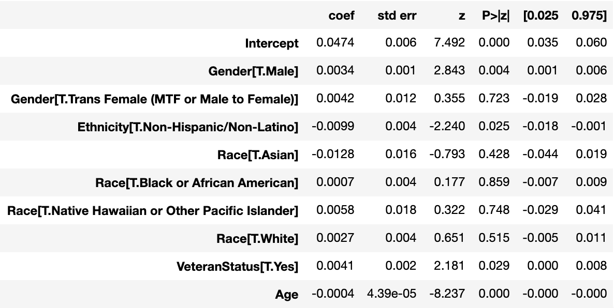

```{r include=FALSE, warning=FALSE}
library(tidyverse)
# read data
duration = read.csv(url("https://raw.githubusercontent.com/datasci611/bios611-projects-fall-2019-Jianqiao-Wang/master/project_3/scripts/duration.csv"))
```

### Backgroud and Introduction
[Urban Ministries of Durham (UMD)](http://www.umdurham.org/) is a program that helps homeless people by providing neighbors with emergency shelter and case management to help them overcome barriers such as unemployment, medical and mental health problems, past criminal convictions and addiction.
This dataset is from the shelter side of UMD. It includes a lot of data about clients upon entry to and exit from the shelter, including age, gender, race, mental health, income, insurance, and many other variables spread across many tables.

The main purpose of this project is to test whether client demographics have an effect on their length of stay in UMD. Specifically, we are interested in the effects of age, gender, race, ethnicity and veteran status. We will first plot the correlation between duration in UMD and different covariates. Then, we will use hypothesis tests to test each covariate's effect.

### Density Plot and Histograms
First of all, we give the estimated density plot of duration
```{r echo=FALSE, message=FALSE, out.width='50%', fig.align='center'}
ggplot(data=duration, aes(x=duration)) +
  geom_density() +
  theme_minimal() +
  theme(axis.title=element_text(size=20),
        axis.text=element_text(size=12))
```
As we can see, the density of duration is a decreasing function, which is similar to exponential distribution or gamma distribution. Moreover, the histograms of duration grouped by different covariates are as follow:

```{r echo=FALSE, message=FALSE, warning=FALSE, out.width='50%'}
# histogram of duration by gender
ggplot(data=duration, aes(x=duration)) +
  geom_histogram(fill='blue') +
  facet_wrap(~ClientGender, scales='free_y', strip.position='bottom') +
  theme_classic() +
  theme(strip.text = element_text(size=7)) +
  labs(title='Gender') +
  theme(plot.title = element_text(hjust = 0.5, size=24), 
        axis.title=element_text(size=20),
        axis.text=element_text(size=12))

# histogram of duration by race
ggplot(data=duration, aes(x=duration)) +
  geom_histogram(fill='blue') +
  facet_wrap(~ClientPrimaryRace, scales='free_y', strip.position='bottom') +
  theme_classic() +
  labs(title='Race') +
  theme(plot.title = element_text(hjust = 0.5, size=24),
        axis.title=element_text(size=20),
        axis.text=element_text(size=12)) +
  theme(strip.text = element_text(size=7))
```

```{r echo=FALSE, message=FALSE, warning=FALSE, out.width='50%'}
# histogram of duration by ethnicity
ggplot(data=duration, aes(x=duration)) +
  geom_histogram(fill='blue') +
  facet_wrap(~ClientEthnicity, scales='free_y', strip.position='bottom') +
  theme_classic() +
  theme(strip.text = element_text(size=16)) +
  labs(title='Ethnicity') +
  theme(plot.title = element_text(hjust = 0.5, size=24),
        axis.title=element_text(size=20),
        axis.text=element_text(size=12))

# histogram of duration by veteran status
ggplot(data=duration, aes(x=duration)) +
  geom_histogram(fill='blue') +
  facet_wrap(~ClientVeteranStatus, scales='free_y', strip.position='bottom') +
  theme_classic() +
  theme(strip.text = element_text(size=16)) +
  labs(title='Veteran Status') +
  theme(plot.title = element_text(hjust = 0.5, size=24),
        axis.title=element_text(size=20),
        axis.text=element_text(size=12))
```
Similarly with the density plot of duration without considering any covariates, the density plots of duration grouped by different covariates are decreasing, with higher density near zero. Therefore, it is reasonalbe to use gamma regression to test effects of these covariates.

#### Gamma Regression
Gamma regression is a specific method in generalized linear models. There are two basic assumptions for gamma regression:

* Distribution assumption: $y_i\sim G(\mu_i, \nu)$ for $i=1,\cdots,n$, where $G(\mu, \nu)$ denotes the gamma distribution with mean $\mu$ and shape parameter $\nu>0$.

* Structural assumption: $\mu_i$ is related to $x_i$ by $$g(\mu_i)=x_i^{T}\beta$$ for $i=1,\cdots,n$, where $g(\cdot)$ is a given monotone link function and $\beta$ is defined in a $\mathcal{R}^{p}$.

For link function $g(\cdot)$, indentity link, canonical link and log link are widely used. In this project, we will use canonical link to test the effect of covariates.

#### Hypothesis Test

For our model, let 'Female', 'Hispanic/Latino', 'American Indian or Alaska Native', 'No' be reference groups for gender, ethnicity, race and veteran status respectively.


